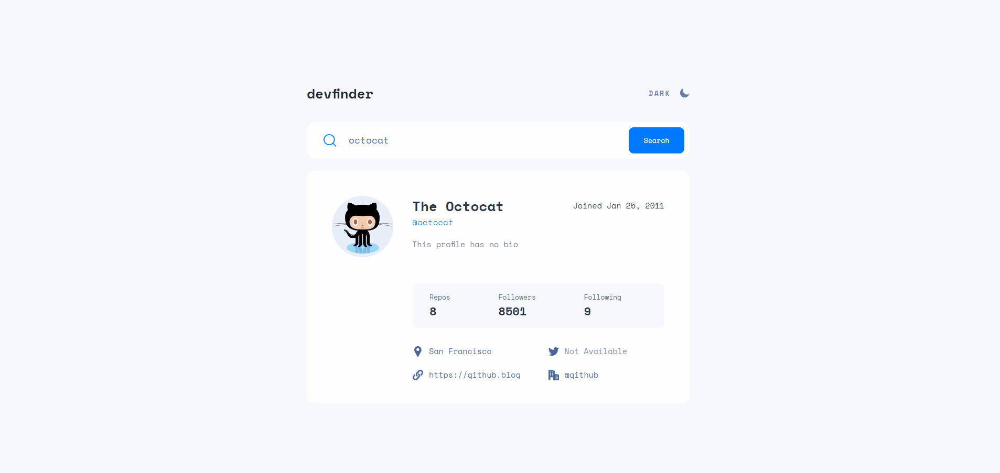

<h1 align="center">
  <span>Github User Search</span>
</h1>

<p align="center">
  <a href="#-projeto">Projeto</a>&nbsp;&nbsp;&nbsp;|&nbsp;&nbsp;&nbsp;
  <a href="#-tecnologias">Tecnologias</a>&nbsp;&nbsp;&nbsp;|&nbsp;&nbsp;&nbsp;
  <a href="#-instalação">Instalação</a>&nbsp;&nbsp;&nbsp;|&nbsp;&nbsp;&nbsp;
  <a href="#memo-licença">Licença</a>
</p>

<br>

<p align="center">
  
</p>

<br>

## 💻 Projeto

Este projeto foi proposto para praticar conceitos do React através do site [Frontend Mentor](https://www.frontendmentor.io/challenges/github-user-search-app-Q09YOgaH6). Neste projeto temos as seguintes funcionalidades:

-   Veja o layout ideal para o aplicativo, dependendo do tamanho da tela do dispositivo
-   Veja os estados de foco para todos os elementos interativos na página
-   Pesquise usuários do GitHub pelo nome de usuário
-   Veja informações relevantes do usuário com base em sua pesquisa
-   Alternar entre temas claros e escuros

## 🚀 Tecnologias

Esse projeto foi desenvolvido com as seguintes tecnologias:

-   [TypeScript](https://www.typescriptlang.org/)
-   [React](https://pt-br.reactjs.org/)
-   [Styled Components](https://styled-components.com/)
-   [Vite](https://vitejs.dev/)
-   [Vercel](https://vercel.com/)

## 📥 Instalação

Faça um clone desse repositório e acesse o diretório. Em instale todas as dependências com o seguinte comando:

```bash
npm i
```

Em seguida execute o comando

```bash
npm run dev
```

## :memo: Licença

Esse projeto está sob a licença MIT. Veja o arquivo [LICENSE](LICENSE.md) para mais detalhes.

---

**Desenvolvido por [Bruno César](https://github.com/brunocs90).**
